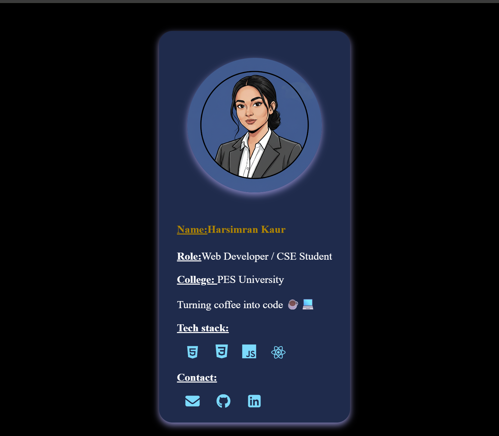

# 🌸 React Business Card

A **cute and professional personal business card** built with **React and CSS**.  
Perfect for beginners learning **React components, CSS styling, and responsive layouts**.

---

## 🔹 Features
-  Responsive design for desktop and mobile  
-  Circular profile image with box shadow  
-  Interactive social icons (GitHub, LinkedIn, Email) with hover effect  
-  Tech stack icons to showcase your skills  
-  Minimal and clean layout — cute yet professional  

---

## 💻 Tech Stack
- **React** – For building components  
- **CSS & Flexbox** – Layout and styling  
- **Font Awesome** – Social icons  
- **DevIcons** – Tech stack icons  

---

## 🎨 Screenshot
  

---

## 🚀 Getting Started

### 1️⃣ Clone the repository
```bash
git clone https://github.com/your-username/react-business-card.git
cd react-business-card
